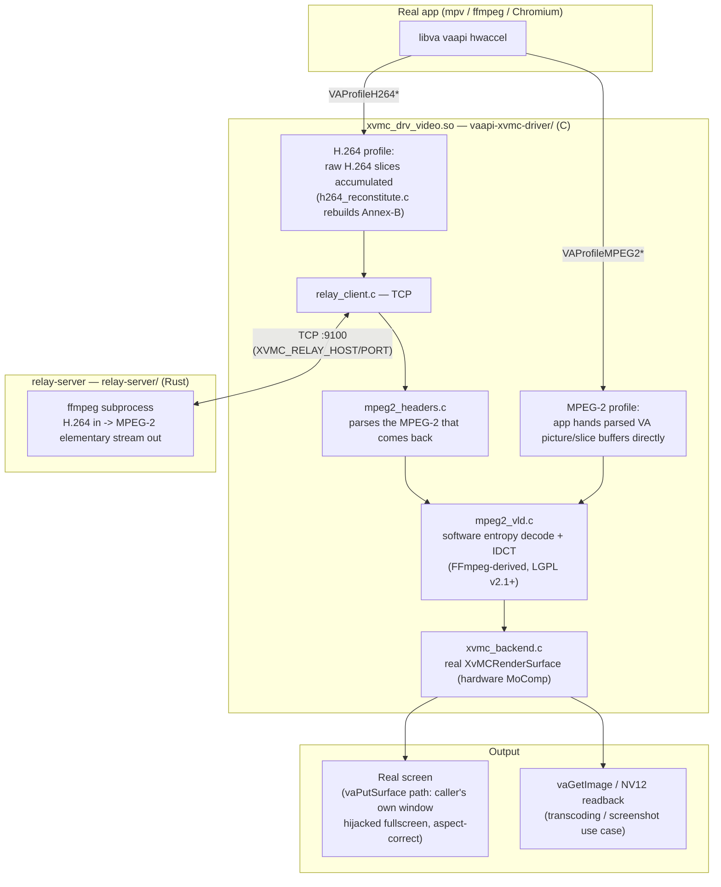

# vaapiRemoteTranscoding

A VA-API driver for the Intel GMA 950 (945GSE, e.g. Acer Aspire One) that
transparently relays H.264 decode to a remote transcode server and plays the
result back locally via real XvMC hardware decode — or decodes local MPEG-2
content directly, no relay involved. Any standard app (mpv, ffmpeg, Chromium)
picks it up via `LIBVA_DRIVER_NAME` with no other changes.

Verified end-to-end on real target hardware (Acer Aspire One, Intel
GMA950/945GSE, Arch Linux 32) — not simulated, not WSL-only.

See [PLAN.md](PLAN.md) for the full design rationale and phased build history.

## Architecture

Two decode paths, converging on the same local XvMC pipeline:



- **`relay-server/`** (Rust) — takes an H.264 source, transcodes to MPEG-2 via
  an `ffmpeg` subprocess, and serves it over a TCP connection. Two modes:
  `pull` (fixed source, serves MPEG-TS to any client — used for standalone
  testing, no driver involved) and `push` (the driver sends its H.264
  bitstream live over the same connection it reads MPEG-2 back from — this
  is what real playback uses). Packaged as a Docker image
  (`relay-server/Dockerfile`) and deployable via a Proxmox LXC helper script
  (`deploy/proxmox/`).
- **`vaapi-xvmc-driver/`** (C) — the `libva` backend driver (`.so`).
  - **MPEG-2 profile** (`VAProfileMPEG2Simple/Main`): the calling app hands
    already-parsed VA picture/slice-parameter buffers straight to this
    driver's own software entropy decoder (`mpeg2_vld.c`), which feeds
    decoded macroblocks to the real XvMC hardware for motion compensation.
    No network, no relay-server, works standalone.
  - **H.264 profile** (`VAProfileH264*`): this chip has zero H.264 decode
    hardware, so raw H.264 slices are reconstituted into a valid Annex-B
    stream (`h264_reconstitute.c`) and forwarded live to `relay-server`'s
    `push` mode (`relay_client.c`). The MPEG-2 that comes back is parsed
    (`mpeg2_headers.c`) and fed through the *same* local XvMC pipeline as
    the MPEG-2 path above — from that point on the two paths are identical.
  - Display: the real `vaPutSurface` path hijacks the caller's own window
    to fill the screen (aspect-ratio preserved, real hardware-scaled blit,
    zero extra cost) regardless of what size/position the caller itself
    requested — see `xvmc_backend_put_surface`.
  - C rather than Rust: the `VADriverVTable` population work is inherently
    C-ABI shaped regardless of language, and C avoids the panic-across-FFI
    hazard a Rust `extern "C"` entry point would otherwise need
    `catch_unwind` for. Packaged for Arch Linux 32 via `deploy/aur/PKGBUILD`.
- **`docs/`** — [benchmark results](docs/benchmark-results.md) (real, isolated
  decode+render timing on the actual GMA950 netbook) and validation notes
  from Phase 0.

## Real hardware constraints — read this before deploying

- **Resolution ceiling: 720×576 (classic PAL broadcast SD), hard limit.**
  Confirmed by bisection on the real i915/945 XvMC hardware: 720×576 decodes
  correctly, 720×608 and 736×480 both fail outright. This is an independent
  width (≤720) and height (≤576) cap, not a total-pixel-count limit. The
  driver now checks this itself before ever touching XvMC (see
  `XVMC_BACKEND_MAX_WIDTH`/`HEIGHT` in `xvmc_backend.h`) and fails cleanly
  with `VA_STATUS_ERROR_RESOLUTION_NOT_SUPPORTED` — real apps like ffmpeg's
  `vaapi` hwaccel already query this via `vaQuerySurfaceAttributes` and
  self-reject before ever asking for a surface. **Practical implication:**
  `relay-server`'s `--resolution`/`RELAY_RESOLUTION` (default `640x480`,
  already safe) must never be configured above `720x576`, or nothing above
  that size will ever be usable through this driver at all — not slow, not
  degraded, simply unavailable. The upside: downscaling a large source down
  to this driver's working range isn't a cost you pay for the privilege —
  measured for real, `relay-server` transcodes *faster* at a smaller output
  size than at the source's own resolution, since encode cost scales with
  output pixel count (see
  [benchmark results](docs/benchmark-results.md#relay-server-downscaling-costs-nothing-extra--its-faster)).
- **XvMC is not actually faster than software decode on this hardware**,
  anywhere in its usable range. Real benchmarking across the full working
  resolution ladder found the XvMC hybrid path (real hardware
  motion-compensation + this driver's own software entropy-decode/IDCT)
  running consistently **~40–70% slower per frame** than plain software
  MPEG-2 decode, with no narrowing of that gap as resolution increases.
  The real value here isn't raw speed — it's that this is the only decode
  path this chip has for accepting `LIBVA_DRIVER_NAME`-selected playback at
  all, and it frees the CPU from also doing the display blit.
- **H.264-via-relay resolution mismatch — resolved, with one hardware
  caveat.** The local XvMC context for an H.264 profile is sized from
  `XVMC_RELAY_RESOLUTION` (must match relay-server's own
  `--resolution`/`RELAY_RESOLUTION`), not the app's native H.264
  resolution — a real source above 720×576 no longer gets rejected
  outright. `vaGetImage` also now correctly handles native/relay
  resolution mismatches: the decoded buffer is scaled to whatever size
  the app's own `VAImage` declared via a real hardware-scaled
  `XvMCPutSurface` blit (the same trick the display path already uses),
  not a CPU-side resize. Confirmed end-to-end with a real 1024×576 H.264
  source relayed down to 640×480, including full image readback
  (`ffmpeg -hwaccel vaapi ... -f null -`, all frames, clean exit).
  **Caveat:** this readback path works by blitting onto an off-screen
  window and reading the composited result back off the root window
  (necessary — reading an XvMC/Xv overlay surface's own window directly
  can return the raw colorkey instead of real video), so the requested
  image size is capped by the **real display's physical resolution**,
  not just the 720×576 XvMC ceiling. A 1280×960 source hit exactly this
  on the netbook's 1024×600 screen (`X_ShmGetImage` `BadMatch`, reading
  out of the root window's bounds) — keep `XVMC_RELAY_RESOLUTION` (and
  any native H.264 resolution that will need image readback, not just
  display) at or under the real screen's resolution.
- **App compatibility: ffmpeg's CLI works out of the box; mpv (0.35.0,
  tested) does not, and it's not a bug in this driver.** `ffmpeg -hwaccel
  vaapi -hwaccel_device :0` explicitly requests the X11-native `VADisplay`
  this driver implements. mpv's `--hwdec=vaapi`, at least in 0.35.0, has
  no equivalent — its hwaccel device creation is hardcoded to open a DRM
  render node (`/dev/dri/renderD128`, the real i915 node, unrelated to
  this driver's `LIBVA_DRIVER_NAME=xvmc` selection), and `--vaapi-device`
  only accepts a DRM device path, not an X11 display string. Confirmed on
  real hardware: mpv logs `Could not create device` for `h264-vaapi` and
  silently falls back to software decoding, then creates a *separate,
  unrelated* `vo=vaapi` display surface sized to the software-decoded
  frame's native resolution (bypassing `XVMC_RELAY_RESOLUTION` entirely,
  since no H.264 profile/relay path was ever actually reached) — which is
  why that surface creation can independently hit the raw 720×576
  ceiling. Real interactive playback through this driver's H.264 path is
  currently an ffmpeg-CLI-verified capability, not a general "any VA-API
  app" one; each additional app needs its own X11-vs-DRM device-selection
  check before assuming it'll work.
- **`tools/vaapi_x11_shim.so` closes part of that gap** — an
  `LD_PRELOAD` shim that intercepts `vaGetDisplayDRM(fd)` and redirects
  it to the real X11 `vaGetDisplay($DISPLAY)` instead. `VADisplay` is
  opaque to the caller, so everything from `vaInitialize` onward is
  unaffected by how it was obtained. **Verified working end-to-end** with
  `ffmpeg`'s own `-hwaccel_device` pointed at a real DRM path
  (`/dev/dri/renderD128`) instead of `:0` — both local MPEG-2 and the
  full H.264-via-relay pipeline complete cleanly (240/240 frames, no
  crash) that otherwise crash outright without the shim (confirmed: real
  `ffmpeg` segfaults trying to use this X11-only driver via a raw DRM
  fd, since `xvmc_backend_open` blindly casts `ctx->native_dpy` to an X11
  `Display*`, which is garbage on the real DRM winsys). **Confirmed NOT
  sufficient for mpv's H.264 hwdec specifically**: mpv 0.35.0's decode
  path still fails "Could not create device" for H.264 even with the
  shim active (its MPEG-2 behavior differs in ways not yet root-caused —
  possibly reusing its own `vo=vaapi` X11 connection rather than
  requesting a fresh DRM-backed one for that codec). mpv's *display*
  path is separately blocked regardless: its legacy `vo=vaapi` always
  calls `vaPutImage` to upload decoded frames, which this driver can't
  implement — XvMC surfaces are opaque, populated only by real hardware
  decode, never by image upload. Usage:
  `LD_PRELOAD=./tools/vaapi_x11_shim.so ffmpeg -hwaccel vaapi -hwaccel_device /dev/dri/renderD128 ...`
- **B-frames: work correctly on the direct MPEG-2 path; not handled on
  the H.264-via-relay path (currently harmless).** These are genuinely
  different mechanisms, easy to conflate. On the direct path, the real
  calling app (ffmpeg's own MPEG-2 hwaccel) supplies
  `forward_reference_picture`/`backward_reference_picture` directly in
  the `VAPictureParameterBufferMPEG2` it hands this driver — correct
  bipredictive reference handling is the *app's* job, not this driver's,
  and it's already been done by the time we see it. **Verified on real
  hardware** with a real B-frame-containing motion clip (not a static
  test pattern, which wouldn't meaningfully exercise bidirectional
  prediction): decoded output visually identical to a software reference
  decode of the same frame, no ghosting/misalignment. On the
  H.264-via-relay path, this driver has to reconstruct MPEG-2 reference
  tracking itself by parsing the raw stream relay-server sends back
  (`mpeg2_headers.c` can't recover real reference IDs from the bitstream
  alone), and currently only tracks a single forward reference for
  P-pictures — B-pictures would decode with no reference at all. This is
  **not currently a live risk**: verified relay-server's actual `ffmpeg
  -c:v mpeg2video` transcode settings never produce B-frames in its
  MPEG-2 output (checked via `ffprobe`'s `pict_type`, I/P only). It would
  become one if relay-server's encode settings ever changed to allow
  them (e.g. adding `-bf`).

## Quick start

The fastest way to see this work end-to-end, no `relay-server` or network
required at all — decode a local MPEG-2 file directly:

```bash
cd vaapi-xvmc-driver
make                                    # builds xvmc_drv_video.so
export DISPLAY=:0                       # the real X server (XvMC needs it)
export LIBVA_DRIVER_NAME=xvmc
export LIBVA_DRIVERS_PATH=$PWD          # skip this if installed system-wide

# Real decoded video, hardware-scaled fullscreen, on your actual screen:
ffmpeg -hwaccel vaapi -hwaccel_device :0 -i your_video.m2v -f null -
```

The explicit `-hwaccel_device :0` matters — ffmpeg defaults to a DRM
`VADisplay`, which this X11-only driver can't use.

Or use the project's own minimal player, which drives the exact same
zero-copy `vaPutSurface` display path:

```bash
make test/local_mpeg2_player
./test/local_mpeg2_player your_video.m2v 24 ./xvmc_drv_video.so
```

Don't have an `.m2v` handy? Any video works after re-encoding to MPEG-2 at or
under the resolution ceiling:

```bash
ffmpeg -i input.mp4 -vf scale=640:480 -c:v mpeg2video -qscale:v 2 -an out.m2v
```

## Installation

### Prerequisites (on the GMA950/945GSE machine)

1. **Enable XvMC in the Intel DDX driver** — disabled by default. Add to
   `/etc/X11/xorg.conf.d/20-intel.conf`:
   ```
   Section "Device"
       Identifier "Intel Graphics"
       Driver     "intel"
       Option     "XvMC"         "true"
       Option     "XvMCSurfaces" "6"
   EndSection
   ```
2. **Point `libIntelXvMC` at itself** — `/etc/X11/XvMCConfig` must exist and
   contain the path to the real library:
   ```
   /usr/lib/libIntelXvMC.so
   ```
3. Restart X. Confirm the extension is live:
   ```bash
   xdpyinfo | grep XVideo-MotionCompensation
   ```
4. Dev packages: `libva`, `libxvmc`, `libxv`, `libx11` (headers + libs).

### Building & installing the driver

```bash
cd vaapi-xvmc-driver
make                                            # xvmc_drv_video.so
sudo install -Dm755 xvmc_drv_video.so /usr/lib/dri/xvmc_drv_video.so
```

Always rebuild **on the target machine** — `-march=native`/`-mtune=native`
are evaluated at build time for whatever CPU is actually compiling; a
binary built elsewhere may use instructions the real (often much older)
CPU doesn't have.

Arch Linux 32 packaging (builds in place from this repo tree, no network
fetch):

```bash
cd deploy/aur
makepkg -si
```

Once installed system-wide, `LIBVA_DRIVERS_PATH` isn't needed — just
`LIBVA_DRIVER_NAME=xvmc`.

### Building & running relay-server (only needed for H.264 sources)

Local build:

```bash
cd relay-server
cargo build --release
./target/release/relay-server push --listen 0.0.0.0:9100 --resolution 640x480 --quality 4
```

Docker:

```bash
cd relay-server
docker build -t relay-server:local .
docker run -d --name relay-server --restart unless-stopped -p 9100:9100 \
    -e RELAY_LISTEN=0.0.0.0:9100 -e RELAY_RESOLUTION=640x480 -e RELAY_QUALITY=4 \
    relay-server:local push
```

Proxmox LXC: `deploy/proxmox/install.sh` is the single entrypoint, run on
the Proxmox host as root. It auto-detects whether a relay-server
container already exists (tagged `vaapi-relay-server`) and either
provisions a fresh one or updates it in place (`RELAY_SOURCE`/data
preserved):

```bash
bash -c "$(curl -fsSL https://raw.githubusercontent.com/N0t4R0b0t/vaapiRemoteTranscoding/main/deploy/proxmox/install.sh)"
# or, from a local checkout: REPO_SRC=/path/to/vaapiRemoteTranscoding deploy/proxmox/install.sh
# force a mode explicitly: deploy/proxmox/install.sh install   (or: update)
```

`install.sh` sources `create-lxc.sh` (host-side: template resolution,
`pct create`, device passthrough) and, inside the container, runs
`container-setup.sh` (Docker, image build, container start).

With an Nvidia GPU on the Proxmox host, pass it through for
hardware-accelerated *decode* of the incoming H.264 source. **Verified
end-to-end on real Proxmox VE 9 + Nvidia Quadro P400 hardware
(2026-07-18)** — fresh install, GPU passthrough, driver/toolkit setup,
and update-mode all confirmed working, including a real NVDEC decode
corruption bug (missing `--enable-parser=h264` in the minimal ffmpeg
build) that's since been found and fixed:

```bash
GPU_PASSTHROUGH=nvidia NVIDIA_DRIVER_VERSION=550.120 deploy/proxmox/install.sh
```

This is decode-only, not a fully hardware-accelerated pipeline — NVENC
(Nvidia's hardware encoder) has never supported MPEG-2 output, so the
encode side stays on ffmpeg's native software `mpeg2video` encoder
regardless. `NVIDIA_DRIVER_VERSION` must exactly match the Proxmox
host's own installed driver (`nvidia-smi` on the host shows it) — the
container shares the host's kernel module and only needs a matching
userspace driver installed inside it. Containers are unprivileged by
default (confirmed working — real Nvidia device nodes are
world-accessible); device majors are queried dynamically from the live
host, not hardcoded.

## Usage

### Environment variables

| Variable | Default | Applies to | Purpose |
|---|---|---|---|
| `LIBVA_DRIVER_NAME` | — | driver | Set to `xvmc` to select this driver. |
| `LIBVA_DRIVERS_PATH` | system dirs | driver | Where to find `xvmc_drv_video.so` if not installed system-wide. |
| `DISPLAY` | — | driver | Must point at a real X server with XvMC enabled (not a DRM/headless VADisplay). |
| `XVMC_RELAY_HOST` | `127.0.0.1` | driver, H.264 path | Where `relay-server push` is listening. |
| `XVMC_RELAY_PORT` | `9100` | driver, H.264 path | Matches relay-server's `--listen` port. |
| `XVMC_RELAY_RESOLUTION` | `640x480` | driver, H.264 path | Must match relay-server's own `--resolution`/`RELAY_RESOLUTION` — the local XvMC context for an H.264 profile is sized from this, not the app's native resolution. |
| `XVMC_RELAY_DEBUG` | unset | driver | Verbose logging of the relay send/receive loop. |
| `XVMC_RELAY_DUMP` | unset | driver | Path to dump every byte of outgoing (reconstituted H.264) bitstream sent to relay-server. |
| `XVMC_RELAY_RECV_DUMP` | unset | driver | Path to dump every byte of the MPEG-2 stream received back from relay-server. |
| `XVMC_PROFILE` | unset | driver | Enables `rdtsc`-based timing breakdowns on stderr. |
| `XVMC_FAKE_GETIMAGE` | unset | driver | **Debug only** — skips the real (expensive) `vaGetImage` readback and returns a cheap synthetic placeholder buffer instead, while still doing a real hardware display blit. Never enable this for real transcoding/screenshotting — the returned pixel data is nonsense by design. |
| `RELAY_LISTEN` | `0.0.0.0:9100` | relay-server | Listen address (both modes). |
| `RELAY_RESOLUTION` | `640x480` | relay-server | Transcode target size — **must stay ≤720x576**, see constraints above. |
| `RELAY_QUALITY` | `4` | relay-server | ffmpeg `-q:v` for the MPEG-2 encode (lower = better quality). |
| `RELAY_HWACCEL` | `none` | relay-server | `nvdec` enables Nvidia-hardware-accelerated *decode* only (see Installation's GPU passthrough section) — requires a passed-through GPU; does nothing useful otherwise. |
| `RELAY_SOURCE` | — | relay-server `pull` only | H.264 source path/URL for the fixed-source test mode. |

### Running a real app

```bash
export LIBVA_DRIVER_NAME=xvmc
export XVMC_RELAY_HOST=192.168.1.50   # wherever relay-server push is running
ffmpeg -hwaccel vaapi -hwaccel_device :0 -i https://example.com/stream.m3u8 -f null -
```

Any VA-API-aware app picks this up the same way — `mpv --hwdec=vaapi`,
Chromium with hardware video acceleration enabled, etc. — no app-side
changes beyond selecting the driver.

### Testing

```bash
cd vaapi-xvmc-driver
make test        # smoke_test + render_stress_test — self-contained, no real content needed
```

Additional standalone tools (not part of `make test`, built/run manually):

| Binary | What it checks |
|---|---|
| `test/local_mpeg2_player` | Real local `.m2v` playback via the zero-copy `vaPutSurface` display path. |
| `test/local_mpeg2_decode_only_test` | Isolates true decode+render cost (no image transfer) — used for the resolution/performance benchmarking above. |
| `test/reconstruct_frame` | Pure-software decode of one picture to a `.ppm`, no X11/XvMC — isolates decode bugs from display-path bugs. |
| `test/relay_pixel_test`, `relay_pixel_test_pure` | Full relay round-trip (needs a running `relay-server push`) with real or synthetic content. |
| `test/relay_display_test` | Live relay playback into a real, visible window. |

## License

[GPL v2 (or later)](LICENSE) currently, though this may be revisited: the
GPL v2 `libmpeg2`-derived IDCT that originally forced this has since been
**removed and replaced** with a port of FFmpeg's own `simple_idct`
(LGPL v2.1+) — see `vaapi-xvmc-driver/src/mpeg2_vld.c`'s provenance
comments. As of this point, every ported third-party component in this
repository (`mpeg2_vld.c`, `mpeg2_headers.c`) traces back to FFmpeg's
`libavcodec` under LGPL v2.1+, not GPL. Whether to relicense the repository
accordingly is an open decision for the repository owner, flagged in code
comments but not resolved here.
